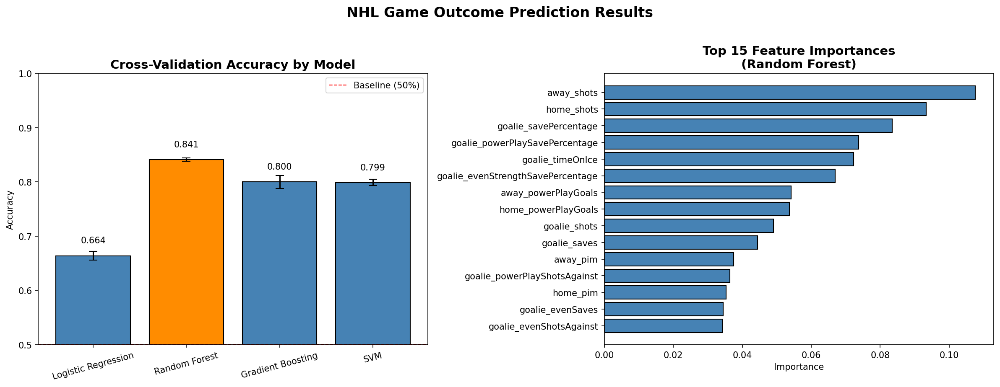

# New Data Analysis Reveals How NHL In-Game Statistics Can Predict Game Outcomes

## Hook

NHL teams generate thousands of data points every game. The challenge is turning shot attempts, save percentages, and power play numbers into a reliable prediction of who wins. It turns out a machine learning model can do it with 84% accuracy.

## Problem Statement

As hockey analytics continues to grow, teams and analysts are collecting increasingly detailed performance data every game, from traditional box score stats to goaltender save percentages and power play efficiency. But without a structured approach to analyzing these metrics, coaches and analysts may struggle to identify which factors actually drive winning. This challenge highlights the need for better data pipelines and predictive models that can get through the noise of a low-scoring, high-variance sport and surface the patterns that matter most.

## Solution Description

This project uses a MongoDB Atlas document database to store and query NHL game-by-game statistics across four collections: game records, team stats, goaltender performance, and team info. A Random Forest classifier was trained on in-game performance metrics, including shots on goal, power play goals, goaltender save percentage, and penalty minutes, achieving 84% accuracy in predicting game outcomes. The model outperformed Logistic Regression, Gradient Boosting, and SVM, and identified shots on goal and goaltender save percentage as the strongest predictors of winning. Insights from this pipeline could help teams, fantasy managers, and analysts move beyond pure instinct and toward data-driven game preparation and roster decisions.

## Chart

The chart above shows the cross-validation accuracy of four machine learning models tested on NHL game data, alongside the top 15 most important features identified by the Random Forest model. Shots on goal and goaltender save percentage come out as the strongest predictors of game outcomes.
